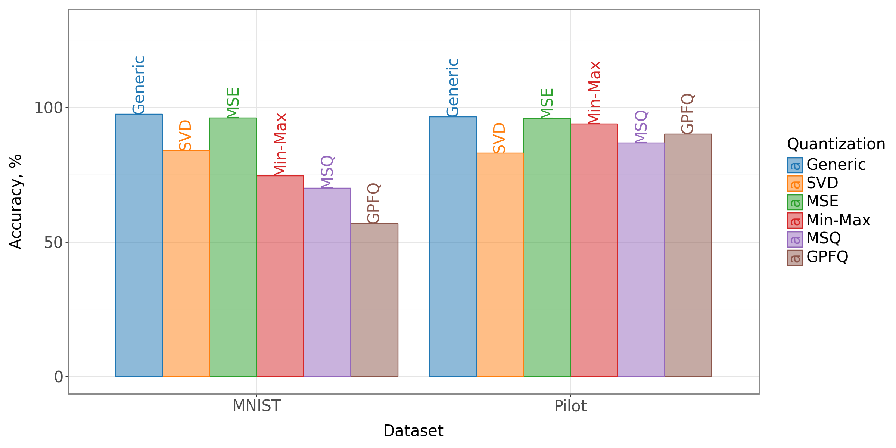
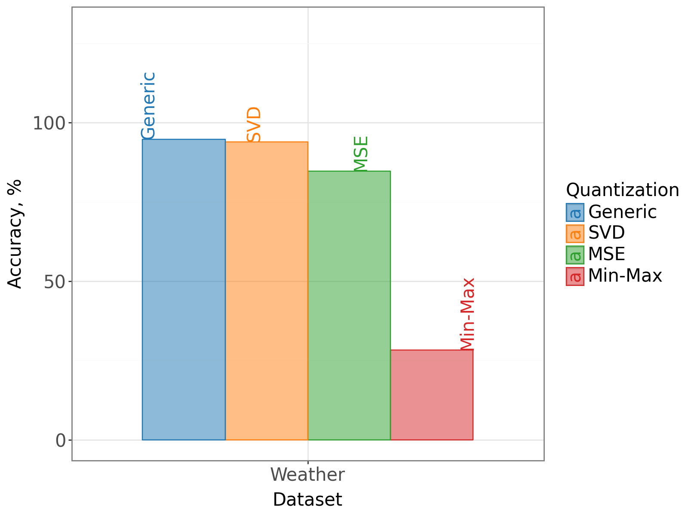

# Quantization Aware Factorization for Model Compression

This repository contains the source code of the Machine Learning course project related to model compression. Post-training quantization aware factorization for linear layers of a fully connected neural network is implemented as a baseline solution. Memoryless Scalar Quantization (MSQ) and Greedy Path Following Quantization are used for the comparison purpoces. The project includes implementations and comparisons of these methods using different datasets and neural network architectures.

## Papers Implemented
1. **[Quantization aware factorization for deep neural network compression](https://arxiv.org/abs/2308.04595)**
2. **[Memoryless scalar quantization for random frames](https://arxiv.org/abs/1804.02839)**
3. **[A greedy algorithm for quantizing neural networks](https://arxiv.org/abs/2010.15979)**

## Files and Directories

- **ADMM_MNIST.ipynb:** Jupyter notebook implementing the ADMM algorithm on a simple three-layer Fully Connected Network (FCN) using the MNIST dataset.
- **ADMM_Plane.ipynb:** Jupyter notebook implementing the ADMM algorithm on a three-layer FCN using the Planes dataset.
- **ADMM_Weather.ipynb:** Jupyter notebook implementing the ADMM algorithm on a network with two convolutional layers followed by three FCN layers, using weather data.
- **GPFQ_MSQ_MNIST_Planes.ipynb:** Jupyter notebook comparing the results of MSQ and Greedy Path Following Quantization on an FCN network using the MNIST and Planes datasets.
- **Model.py:** Python file containing the structures of convolutional and FCN networks used in the ADMM notebooks.
- **Factorization.py:** Python file containing the ADMM methods used in the ADMM notebooks.
- **Quantized_network.py:** Python file containing methods for MSQ and Greedy Path Following Quantization implemented in TensorFlow.
- **data/**: Directory containing the datasets used in the project.
- **Saved_models/**: Directory containing saved models for the ADMM notebooks.
- **Barplot.ipynb:** Jupyter notebook containing data and plots from tests conducted using all implemented methods and models.

## Usage
- Each Jupyter notebook contains implementations of specific methods on different datasets and network architectures. Users can run these notebooks to see the results and comparisons.
- The Python files contain reusable code for network structures, factorization methods, and quantization methods.
- The `data/` directory contains datasets used in the project. Users can add their own datasets if needed.
- The `Saved_models/` directory contains pre-trained models saved from the ADMM notebooks.

## Dependencies
- This project uses TensorFlow and PyTorch for deep learning implementations.
- You may find a list of the necessary packages in `requirements.txt` file

## Results
- Detailed results and comparisons can be found in the `Barplot.ipynb` notebook.

Below are the barplots illustrating the performance comparison between different compression methods:

1. **MNIST and Planes dataset on three-layer Fully Connected Network**

2. **Weather dataset on a network with two convolutional layers followed by three FCN layers**

